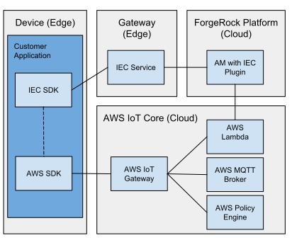

## AWS IoT Integration
### Introduction
The ForgeRock Platform with the IEC can be used for identity management, authentication and authorisation of devices
when deployed alongside the AWS IoT Cloud platform. AWS IoT Core offers a custom mechanism by which devices in
possession of an OAuth2 token can be authenticated and authorised before being allowed to publish or subscribe to
messages from the AWS MQTT broker. This integration example demonstrated how the IEC can be used to facilitate custom
authentication with AWS.

Components in the example are:
- Client application
    - retrieves OAuth2 access token via IEC SDK
    - creates authentication token and signature for AWS authentication
    - publishes a message to the AWS MQTT broker
- AWS Custom Authentication Lambda
    - validates and introspect access token with AM
    - builds AWS policy based on access token scope
- IEC Service
    - facilitates registration and token issuing for client application
- AM
    - register edge nodes
    - issues OAuth2 access token
    - validates and introspects access token

### Prerequisites

- ForgeRock BackStage account with access to AM, DS and the IEC
- [Docker](https://docs.docker.com/install/) and [Docker Compose](https://docs.docker.com/compose/install/)
- AM installed as described in the [Installation Guide](../../docs/iec-installation-guide.md)
- AM's OAuth2 endpoints must be accessible from AWS Lambda functions (exposed to the Internet)
- AWS Account and a reasonable understanding of the the following AWS services:
    - AWS IoT - https://docs.aws.amazon.com/iot/latest/developerguide/what-is-aws-iot.html
    - AWS Lambda - https://docs.aws.amazon.com/lambda/latest/dg/getting-started.html
    - AWS IoT custom authentication - https://docs.aws.amazon.com/iot/latest/developerguide/iot-custom-authentication.html

### Prepare AM

AM must be installed and configured as described in the [Installation Guide](../../docs/iec-installation-guide.md). It
must also be exposed to the internet in order for the AWS Lambda function to access AM's OAuth2 `/introspect` endpoint.

For this integration example we deployed AM with the Google Cloud Platform, Kubernetes Engine and exposed the container
to the internet via an external IP address so that AM can be accessed on a URL similar to `http://12.123.123.123:8080/openam`.

If your public AM URL uses an IP address instead of a FQDN then AM must be configured to allow requests on that URL.
In the AM console, navigate to `Deployment > Servers`. Clone the existing server and enter your IP address based URL as
the Server URL.

The AWS custom authenticator will make a call to AM's OAuth2 `/introspect` endpoint and authenticate using JWT Bearer
Authentication. Configure this in the AM console by navigating to `Applications > OAuth 2.0 > Groups > DeviceOAuth2Group`:
- On the `Core` tab, add `publish` to `Scopes` and `Default Scopes`
- On the `Signing and Encryption` tab, copy the contents of `examples/aws_custom_auth/keys/device-public.crt` into
 `Client JWT Bearer Public Key` and change `Public key selector` to `x509`

### Prepare configuration

The `.env` file contains all the variables required for the example. Open the file and modify the variables to reflect
your AM and AWS environments.

### Prepare IEC

We will run the IEC and client example in a container called `aws-client`.

Download the IEC resources to `examples/aws_custom_auth/resources`
- [IEC Service](https://backstage.forgerock.com/downloads/get/familyId:edge/productId:iec/subProductId:service/minorVersion:6.5/version:6.5.0/architecture:x86-64/os:linux/distribution:tar)
- [IEC SDK](https://backstage.forgerock.com/downloads/get/familyId:edge/productId:iec/subProductId:sdk/minorVersion:6.5/version:6.5.0/architecture:x86-64/distribution:tar)

Build and start the environment in the background:

    docker-compose up -d --build

In a new terminal run:

    docker exec -it aws-client bash

Install and start the IEC Service by running:

    quick_install

The IEC Service should now be running and registered with AM.

### Prepare AWS IoT

Set up AWS CLI (either on your local machine or in the container)

https://docs.aws.amazon.com/lambda/latest/dg/gettingstarted-tools.html

Create an AWS Lambda Execution Role and call it `iec-custom-authorize-handler-execution-role`

https://docs.aws.amazon.com/lambda/latest/dg/lambda-intro-execution-role.html

Build the AWS custom authorizer handler. This can be done in the `aws-client` container.

    cd examples/aws_custom_auth
    ./build-lambda.sh

From the environment where you installed AWS CLI, deploy the authorize handler. This will create the AWS Lambda and
create the custom authorizer.

    ./deploy-lambda.sh

### Build and run the example client

Build the client application in the `aws-client-device` container:

    cd sdk/examples/aws_custom_auth/
    ./build-client.sh

Run the client application:

    ./run-client.sh

The client will register a device, retrieve the OAuth2 tokens and make the request to AWS to publish a message.
