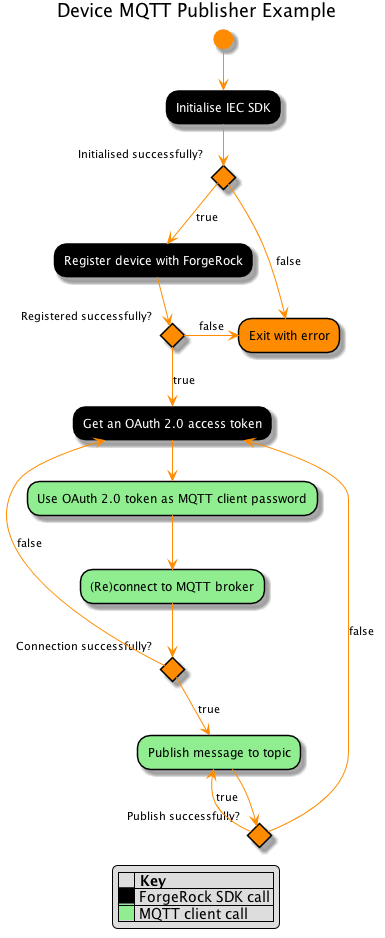
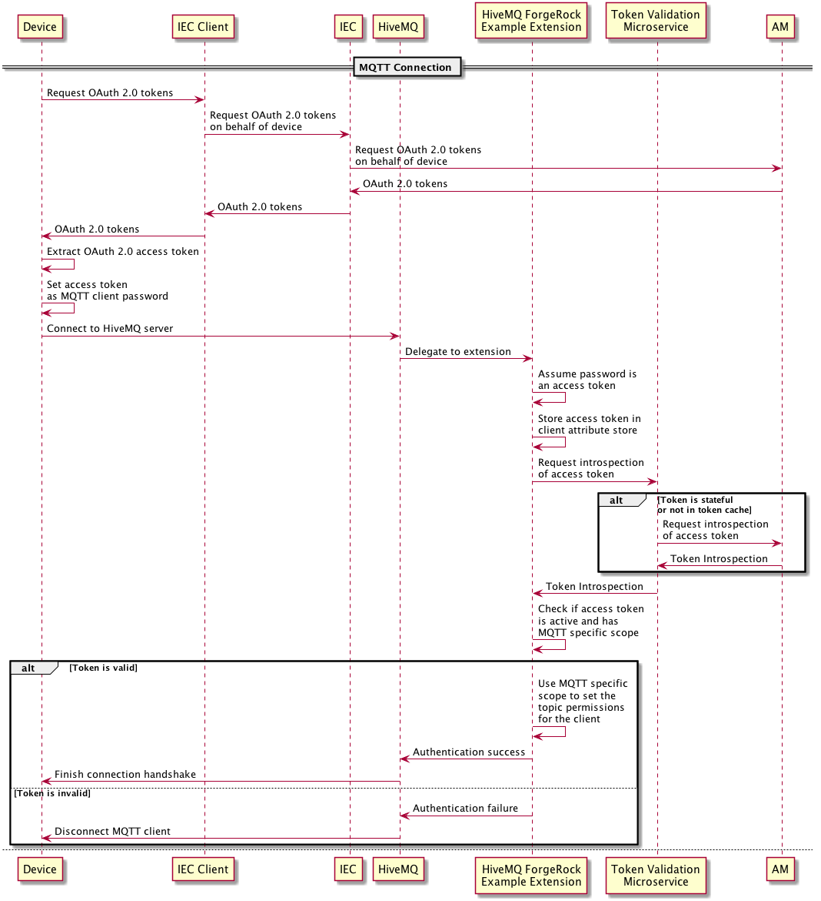
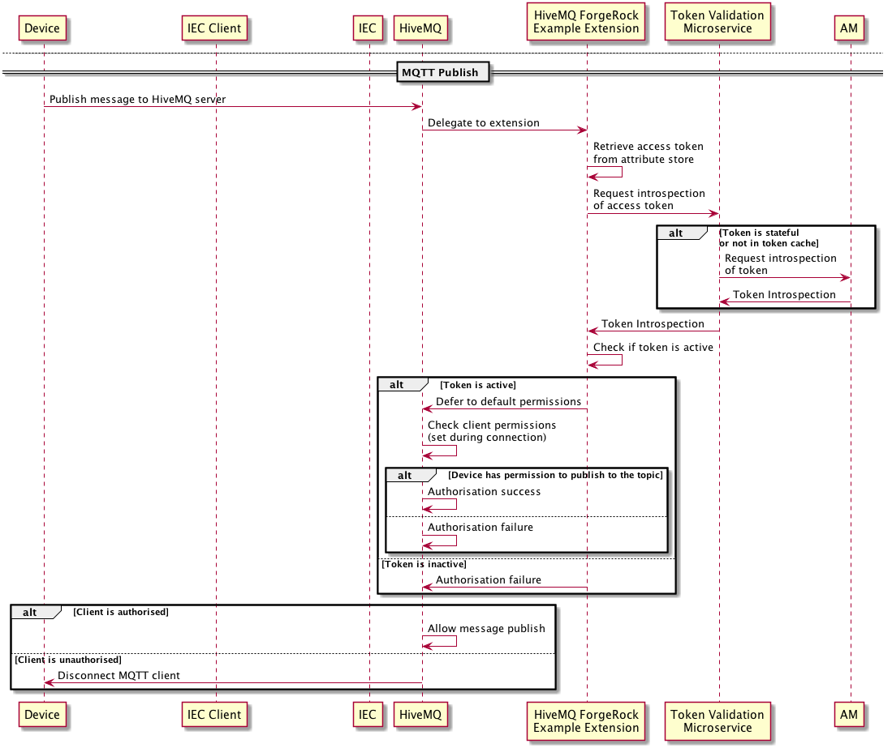

## HiveMQ Integration

### Introduction

[HiveMQ](https://www.hivemq.com/) is a MQTT broker that offers a free, open-source extension SDK. The HiveMQ extension
framework provides an open API that allows developers to create custom extensions.

In this integration, we create an example HiveMQ extension that implements authenticates and authorises MQTT client via
OAuth2 access tokens issued by AM.

Components in the integration are:
- Device application
    - registers a device using the IEC SDK
    - obtains an OAuth 2.0 access token via the IEC SDK
    - connects to HiveMQ using an OAuth2 access token as a password
    - repeatedly publishes to a single topics via HiveMQ
- IEC Service
    - facilitates registration and get token requests for the client application
- AM
    - registers edge nodes
    - introspects OAuth 2.0 access tokens for the Token Validation Microservice
- Token Validation Microservice
    - handles authentication to AM
    - caches token introspections
- ForgeRock Example Extension
    - performs authentication and authorisation for HiveMQ using OAuth 2.0 access tokens
- HiveMQ
    - MQTT broker

### Device Application

The device MQTT publisher example is used in this integration to simulate a device publishing data to a MQTT topic.
This example has no HiveMQ specific code and can be used with any MQTT broker that can validate OAuth 2.0 access tokens
issued by AM.
The example can be described by the following workflow diagram:

### HiveMQ ForgeRock Example Extension

The ForgeRock Example Extension uses the OAuth 2.0 access token supplied as the MQTT client password to authenticate and
authorise the client. On connection, if the password supplied by the client is a valid access token which has the MQTT
specific scope `matt:some/device/topic` then the device is "authenticated" and allowed to connect. Furthermore, the
topic part of the MQTT scope `some/device/topic` is used to set the permissions applied by HiveMQ to authorise
subsequent publish and subscribe requests (in this case `device/data` is used). The following sequence diagram describes
the MQTT connection workflow:

On a publish request, the extension checks whether the token is still valid and if so uses the permissions set at
connection time to check whether the device is allowed to publish to the topic. If the client is unauthorised for any
reason then it is disconnected, thus allowing it to retrieve a fresh token. The following sequence diagram describes
the MQTT publish workflow:

### Prerequisites

- ForgeRock BackStage account with access to AM, IEC and the Token Validation Microservice.
- [Docker](https://docs.docker.com/install/) and [Docker Compose](https://docs.docker.com/compose/install/)
- ForgeRock IEC Training Environment installed as described in [training](../../training)

### Modify the OAuth2 Client Group

Authorisation within the HiveMQ extension is controlled by OAuth 2.0 access token scopes.
To ensure that all devices get this authority by default, modify the `DeviceOAuth2Group` OAuth 2.0 group in AM.

1. Open the `DeviceOAuth2Group` [editor](http://am.iec.com:8080/openam/XUI/#realms/%2Fedge/applications-oauth2/groups/edit/DeviceOAuth2Group)
in the AM Admin Console.
1. Add `mqtt:device/data` to *Scope(s)* and *Default Scope(s)*.
1. Click *Save Changes*.

In order to make a running example client more responsive to OAuth2 client changes, it is recommended that the lifetime
of an access token is decreased for this example. This can be done by further modifying the `DeviceOAuth2Group`
OAuth 2.0 group.

1. Change *Access Token Lifetime (seconds)* to `20`.
1. Click *Save Changes*.

### Register an OAuth2 Client

Register an OAuth 2.0 client with the AM OAuth 2.0 authorisation service that is allowed to introspect access tokens
issued to other clients in the `edge` realm:

1. In the AM console, navigate to the OAuth2 client applications
[view](http://am.iec.com:8080/openam/XUI/#realms/%2Fedge/applications-oauth2) for the `edge` realm.
Ensure the *Clients* tab is selected.
1. Select *Add Client*
1. Enter the following values:
	* Client ID: `mqtt_oidc_client`
	* Client Secret: `password`
	* Scope(s): `am-introspect-all-tokens`
1. Select *Create*

Refer to the AM documentation for more information about
[registering](https://backstage.forgerock.com/docs/am/6.5/oauth2-guide/#register-oauth2-client) and
[configuring](https://backstage.forgerock.com/docs/am/6.5/oauth2-guide/#configure-oauth2-client) OAuth2 Clients.

### Prepare the environment

Download the Token Validation Microservice resources,

* to `mstokval/resources`
  * [Token Validation Microservice](https://backstage.forgerock.com/downloads/browse/ig/latest)

### Build and run the Token Validation Microservice container

Build a container that has the ForgeRock Token Validation Microservice installed with all the relevant
configuration to introspect tokens against the AM in the the training environment:

    cd mstokval
    docker build -t mstokval .
    cd -

Run the `mstokval` container:

    docker run --rm  -p 9090:9090 --network training_iec_net \
        --ip 172.16.0.14 --add-host am.iec.com:172.16.0.10 \
        --name mstokval -d mstokval

### Build and package the HiveMQ ForgeRock Example Extension

Build the ForgeRock Example Extension for HiveMQ:

    cd hivemq/hivemq-forgerock-example-extension
    mvn clean
    mvn package
    cd -

### Build and run the HiveMQ container

Build a container that contains a HiveMQ server with the ForgeRock Example Extension installed:

    cd hivemq
    docker build -t hivemq .
    cd -

Run the `hivemq` container:

    docker run --rm  -p 1883:1883 -p 8090:8080 --network training_iec_net \
        --ip 172.16.0.13 --add-host mstokval.example.com:172.16.0.14 \
        --name hivemq -d hivemq

You can check that HiveMQ is running by navigating to the HiveMQ Control Center at `http://localhost:8090/`.
The default login is the username `admin` with the password `hivemq`.

### Build and run the example device mqtt client

Copy the C client examples into the `sdk` container:

	docker cp ../../examples/c sdk:/root/forgerock/c-examples

Enter the `sdk` container:

    docker exec -it sdk bash

Install the Mosquitto Client C library:

    apt-get install --yes libmosquitto-dev

Build the client application:

    cd ~/forgerock/c-examples
    ./build.sh device_mqtt_pub

 Add the IEC SDK library directory to the linker path:

    export LD_LIBRARY_PATH=~/forgerock/lib:${LD_LIBRARY_PATH}
    export DYLD_LIBRARY_PATH=~/forgerock/lib:${DYLD_LIBRARY_PATH}

Run the client application:

    cd ~/forgerock/c-examples/dist/device_mqtt_pub/
    ./device_mqtt_pub

This example will:
1. register a device (with deviceID) with AM via the IEC.
1. create a MQTT client that uses the IEC as a credentials provider.
1. connect the MQTT client to HiveMQ
1. HiveMQ passes the client credentials to the HiveMQ ForgeRock Example Extension.
    1. The extension will call out to the Token Validation Microservice with the access token.
    1. The Token Validation Microservice returns the introspection of the access token.
    1. If the token is valid and has the correct scopes, then the connection is authorised.
1. the client will publish a new count every second to the `device/data`.

### Receive the data published by the example device

It is possible to receive the messages sent by the example device over MQTT from the command line on the host machine.
The following assumes that the host machine has the following:

* curl
* jq
* mosquitto client (any MQTT client can be used)

An OAuth 2.0 access token is required to connect\subscribe to the MQTT server, so create an OAuth 2.0 client to
request access tokens:

1. In the AM console, navigate to the OAuth2 client applications
[view](http://am.iec.com:8080/openam/XUI/#realms/%2Fedge/applications-oauth2) for the `edge` realm.
Ensure the *Clients* tab is selected.
1. Select *Add Client*
1. Enter the following values:
    * Client ID: `human_client`
    * Client secret: `password`
    * Scope(s): `mqtt:device/data`
1. Select *Create*
1. On the Advanced tab, select the following option:
    * Grant Types: `Client Credentials`
1. Select *Save Changes*

Request a token:

    human_token=$(curl --request POST \
        --url http://am.iec.com:8080/openam/oauth2/realms/root/realms/edge/introspect/access_token \
        --user human_client:password \
        --data grant_type=client_credentials  \
        --data scope=mqtt:device/data \
        --silent | jq -r .access_token)

Subscribe to the topic used by the device:

    mosquitto_sub -t device/data \
        -u human -P ${human_token}
